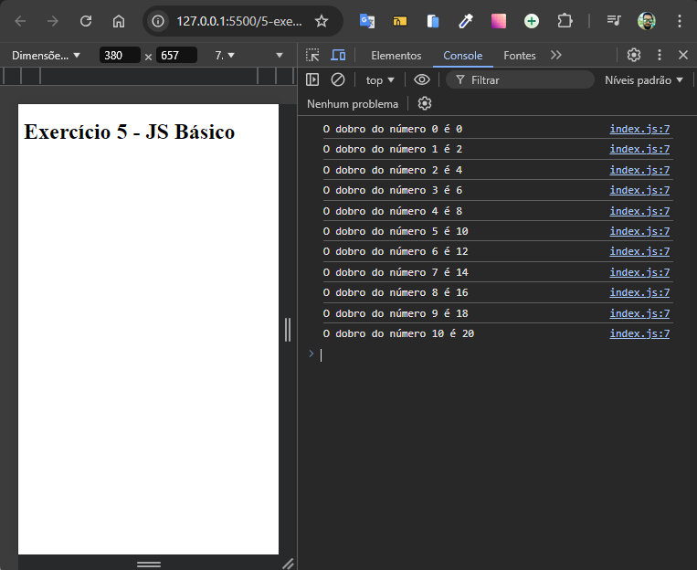

# Dobrando Números com For

Desenvolvido como exercício de JavaScript básico do curso de extensão universitária do DevQuest - Dev em Dobro.

Este projeto foi desenvolvido para demonstrar o uso da estrutura de repetição `for` em JavaScript para dobrar valores numéricos em uma lista. A aplicação itera sobre um array de números, dobrando cada valor e exibindo o resultado na tela.



## Tecnologias Utilizadas

- **HTML**
- **JavaScript**

## Como Usar

1. Clone este repositório:

   ```bash
   git clone https://github.com/Alberesbass/dobrando-numeros-com-for.git
   ```

2. Abra o arquivo `index.html` em seu navegador para ver a aplicação em ação.

## Licença

Este projeto está sob a licença MIT. Consulte o arquivo [LICENSE](./LICENSE) para mais informações.

---

Desenvolvido por [Alberes](https://github.com/Alberesbass)